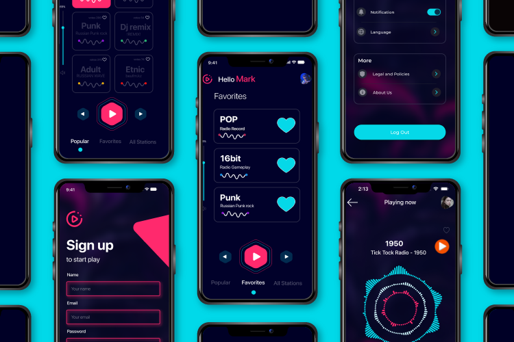

# RadioApp

 

</a>

### В разработке участвовали:

 

### О приложении:

#### RadioApp - приложение, которое позволяет прослушивать множество радиостанций мира.

### Функционал:
  * Авторизация - возможность регистрации и входа зарегистрированного пользователя через почту и пароль или через Google. Функция "забыл пароль" отправляет письмо для сброса пароля на почту пользователя, с возможностью перехода в браузер и изменения пароля через почтовый клиент.
  * Popular - отображение коллекции популярных радиостанций с возможностью их прослушивания, голосования за станцию и добавления ее в избранное.
  * Плеер - проигрыватель с возможностью переключения между радиостанциями и изменения громкомти воспроизведения.
  * Favorites - отображение избранных станций с возможностью удаления из избранного и просмотра детального описания станции, хранение реализовано через Core Data.
  * All stations - отображение всех радиостанций с возможностью просмотра детального описания станции, голосования за станцию и добавления ее в избранное. Реализована возможность поиска станций по названию.
  * Настройки - отображение данных пользователя: персональное фото, имя и почта с возможностью их изменения и выхода из личного кабинета. Реализована смена языка. Вкладки: Положения и условия, About us.

### Swift / UIKit / CoreData
  
### Архитектура: 
MVP+Router
  
### Фреймворки: 
  * SnapKit
  * Firebase
  * Google SignIn
  * RadioBrowser (*by [ShapovalovIlya](https://github.com/ShapovalovIlya)*)
  * Kingfisher
  * Lottie
